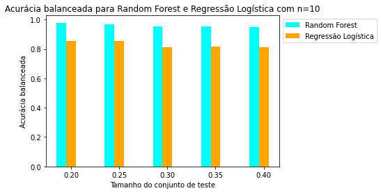
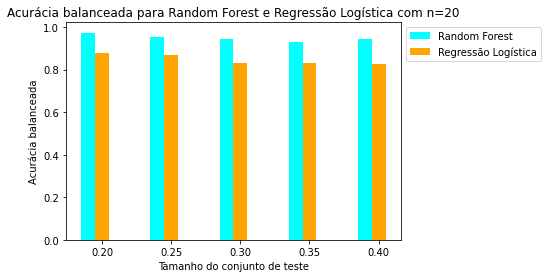
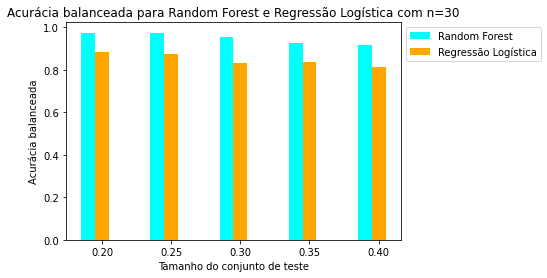
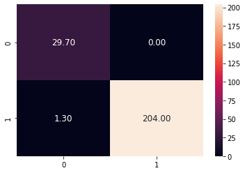
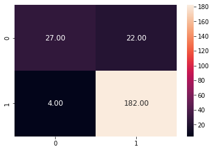
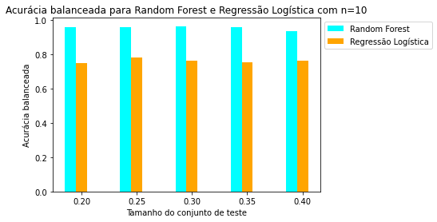
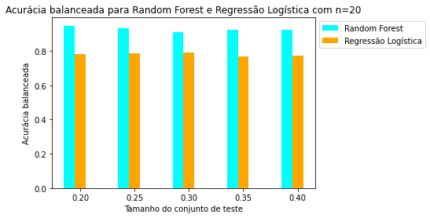
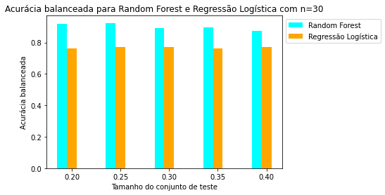
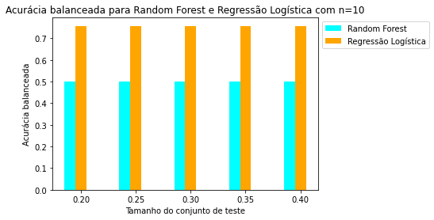
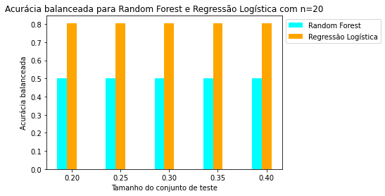

# Projeto 2 – Predizendo Prognóstico de Mortalidade com Dados Sintéticos
Trabalho 2 de Ciência e Visualização de Dados em Saúde

# Apresentação
O presente projeto foi originado no contexto das atividades da disciplina de pós-graduação Ciência e Visualização de Dados em Saúde, oferecida no primeiro semestre de 2022, na Unicamp.

| Nome  |  RA  | Especialização |
| ------------------- | ------------------- | ------------------- |
|  Rebeca Padovani Ederli |  201482 | Ciência da Computação |

# Contextualização da Proposta

Synthea é um gerador sintético de pacientes que modela o histórico médico de pacientes fictícios. Os dados Synthea, embora sintéticos, são realistas e livres de restrições de custo e privacidade, podendo ser utilizado para pesquisas acadêmicas e indústria [1]. O prognóstico, na área médica, éum conhecimento antecipado, realizado por um profissional, com base necessariamente no diagnóstico médico e nas possibilidades acerca da duração, evolução de uma condição ou doença apresentadas sob os cuidados e orientação desse profisional. Neste sentido, este projeteo tem como objetivo realizar a predição de prognóstico de mortalidade, não por meio de conhecimentos de profissionais da área médica, mas com a construção de modelos de aprendizado de máquina, que serão treinados com os dados sintéticos Synthea. Assim , a perguta de pesquisa presente é "qual é o prognóstico de mortalidade dos pacientes, com base no histórico médico disponível?".

# Ferramentas

Foi utilizada a linguagem de programação Python e o ambiente Google Colab para implementação e análise dos experimentos.

# Metodologia 

Como parâmetros para extração de características, os dados dos arquivos "conditions.csv", "encounters.csv", "observations.csv", "medications.csv" e "procedures.csv", além de "patients.csv", foram considerados importantes para a predição de prognóstico de mortalidade, principalmente pelo fato dos seus dados estarem relacionados um com os outros.

A metodologia utilizada para a extração de features consiste em, primeiro obter o número de interações que um paciente tem com o hospital: procedures, medicamentos, condições, encontros. Não necessariamente a qualidade dessas interações, apenas as quantidades. Em seguida obteve-se Embedding/vetorização de conceitos categóricos em vez de OHE (one-hot-encoding) e esses vetores foram concatenados com as outras features numéricas.

O embedding foi realizado utilizando os seguintes passos:

1. Organização em ordem decrescente dos conceitos: escolher apenas os últimos, n mais recentes;
2. Concatenar palavras em conceitos: por exemplo, encounter for symptom = encounter_for_symptom;
3. Remover duplicações;
4. Tokenização;
5. Vetorização em uma dimensão.

Essa metodologia foi aplicada por Scarlat(2021) utilizando a base de dados Synthea Covid 100k. 

Foram treinados os modelos Random Forest e Regressão Logística nas duas bases de dados utilizadas para realizar comparações. Os experimentos consistem em, resumidamente, testar diferentes quantidades de features (arquivos e quantidades de conceitos) e comparar o comportamento dos dois modelos de aprendizado de máquina citados.

As métricas obtidas nos experimentos consitem nas médias:

- Verdadeiros negativos (tn_mean);
- Falsos positivos (fp_mean);
- Falsos negativos (fn_mean);
- Verdadeiros positivos (tp_mean);
- Precisão (precision_mean);
- Recall (recall_mean);
- F1 score (F1_score_mean);
- Acurácia (accuracy_mean);
- Acurácia balanceada (acc_balanced_mean);

E o respectivo desvio padrão, tendo em vista que foram realizadas 30 iterações para cada experimento.

## Bases Adotadas para o Estudo

- scenario01;
- scenario02.

# Resultados obtidos
Para o primeiro experimento, foram utilizados os arquivos de dados "conditions.csv", "encounters.csv", "procedures.csv", "medications.csv", "observations.csv" e "patients.csv" de scenario01. De cada um desses arquivos, foram extraídos os seguintes dados:

| Arquivo  |  Dados  | Obs.|
| ------------------- | ------------------- | ------------|
| patients.csv |  'RACE', 'ETHNICITY', 'GENDER', 'BIRTHDATE', 'DEATHDATE'| 'BIRTHDATE' é transformada em idade.|
| conditions.csv | 'PATIENT', 'START', 'DESCRIPTION'| |
| encounters.csv | 'PATIENT', 'START', 'DESCRIPTION'| |
| procedures.csv | 'PATIENT', 'START', 'DESCRIPTION' | |
| medications.csv | 'PATIENT', 'START', 'DESCRIPTION' | Apenas medicações que não pararam.|
| observations.csv | 'PATIENT', 'DATE', 'DESCRIPTION' | |

Após a extração de features, como descrita em Metodologia, foram construídos os modelos de classificação Random Forest e Regressão Logística com os parâmetros padrões disponibilizados nas bibliotecas para realizar uma primeira comparação. Os tamanhos do conjunto de teste variaram em 0.20, 0.25, 0.30, 0.35 e 0.40 para visualizar qual  seria o mais adequado. Além disso, as quantidades de variáveis categóricas geradas por meio das descrições (conceitos) dos dados variaram em n = [10, 20 e 30].

Os resultados obtidos para 
- Random Forest com 

-- n=10

|index|Test size|tn\_mean|std tn|fp\_mean|std fp|fn\_mean|std fn|tp\_mean|std tp|precision\_mean|std precision\_mean|recall\_mean|std recall\_mean|F1\_score_mean|std F1\_score_mean|accuracy\_mean|std accuracy\_mean|acc\_balanced_mean|std acc\_balanced_mean|
|---|---|---|---|---|---|---|---|---|---|---|---|---|---|---|---|---|---|---|---|
|0|0\.2|204\.0|0\.0|0\.0|0\.0|1\.3|0\.458|29\.7|0\.458|1\.0|0\.0|0\.958|0\.015|0\.979|0\.008|0\.994|0\.002|0\.979|0\.007|
|1|0\.25|256\.0|0\.0|0\.0|0\.0|2\.6|0\.8|35\.4|0\.8|1\.0|0\.0|0\.932|0\.021|0\.964|0\.011|0\.991|0\.003|0\.966|0\.011|
|2|0\.3|301\.0|0\.0|0\.0|0\.0|4\.9|0\.7|47\.1|0\.7|1\.0|0\.0|0\.906|0\.013|0\.95|0\.007|0\.986|0\.002|0\.953|0\.007|
|3|0\.35|352\.0|0\.0|0\.0|0\.0|5\.5|0\.806|53\.5|0\.806|1\.0|0\.0|0\.907|0\.014|0\.951|0\.008|0\.986|0\.002|0\.954|0\.007|
|4|0\.4|402\.0|0\.0|0\.0|0\.0|6\.6|1\.2|61\.4|1\.2|1\.0|0\.0|0\.903|0\.018|0\.949|0\.01|0\.986|0\.002|0\.951|0\.009|

-- n=20

|index|Test size|tn\_mean|std tn|fp\_mean|std fp|fn\_mean|std fn|tp\_mean|std tp|precision\_mean|std precision\_mean|recall\_mean|std recall\_mean|F1\_score_mean|std F1\_score_mean|accuracy\_mean|std accuracy\_mean|acc\_balanced_mean|std acc\_balanced_mean|
|---|---|---|---|---|---|---|---|---|---|---|---|---|---|---|---|---|---|---|---|
|0|0\.2|204\.0|0\.0|0\.0|0\.0|1\.7|0\.64|29\.3|0\.64|1\.0|0\.0|0\.945|0\.021|0\.972|0\.011|0\.993|0\.003|0\.973|0\.01|
|1|0\.25|256\.0|0\.0|0\.0|0\.0|3\.4|0\.49|34\.6|0\.49|1\.0|0\.0|0\.911|0\.013|0\.953|0\.007|0\.988|0\.002|0\.955|0\.007|
|2|0\.3|301\.0|0\.0|0\.0|0\.0|5\.9|0\.539|46\.1|0\.539|1\.0|0\.0|0\.887|0\.01|0\.94|0\.006|0\.983|0\.002|0\.943|0\.005|
|3|0\.35|352\.0|0\.0|0\.0|0\.0|8\.3|0\.9|50\.7|0\.9|1\.0|0\.0|0\.859|0\.015|0\.924|0\.009|0\.98|0\.002|0\.93|0\.007|
|4|0\.4|402\.0|0\.0|0\.0|0\.0|7\.8|1\.327|60\.2|1\.327|1\.0|0\.0|0\.885|0\.019|0\.939|0\.011|0\.983|0\.003|0\.943|0\.01|

-- n=30
|index|Test size|tn\_mean|std tn|fp\_mean|std fp|fn\_mean|std fn|tp\_mean|std tp|precision\_mean|std precision\_mean|recall\_mean|std recall\_mean|F1\_score_mean|std F1\_score_mean|accuracy\_mean|std accuracy\_mean|acc\_balanced_mean|std acc\_balanced_mean|
|---|---|---|---|---|---|---|---|---|---|---|---|---|---|---|---|---|---|---|---|
|0|0\.2|204\.0|0\.0|0\.0|0\.0|1\.6|0\.663|29\.4|0\.663|1\.0|0\.0|0\.948|0\.022|0\.974|0\.011|0\.993|0\.003|0\.974|0\.011|
|1|0\.25|255\.9|0\.3|0\.1|0\.3|2\.1|0\.3|35\.9|0\.3|0\.997|0\.008|0\.944|0\.008|0\.97|0\.005|0\.992|0\.001|0\.972|0\.004|
|2|0\.3|301\.0|0\.0|0\.0|0\.0|4\.7|0\.64|47\.3|0\.64|1\.0|0\.0|0\.91|0\.012|0\.952|0\.007|0\.987|0\.002|0\.955|0\.006|
|3|0\.35|352\.0|0\.0|0\.0|0\.0|8\.7|1\.792|50\.3|1\.792|1\.0|0\.0|0\.852|0\.03|0\.92|0\.018|0\.979|0\.004|0\.927|0\.015|
|4|0\.4|401\.1|0\.7|0\.9|0\.7|11\.2|1\.4|56\.8|1\.4|0\.984|0\.012|0\.836|0\.021|0\.904|0\.016|0\.974|0\.004|0\.917|0\.011|

- Regressão Logística com

-- n=10

|index|Test size|tn\_mean|std tn|fp\_mean|std fp|fn\_mean|std fn|tp\_mean|std tp|precision\_mean|std precision\_mean|recall\_mean|std recall\_mean|F1\_score_mean|std F1\_score_mean|accuracy\_mean|std accuracy\_mean|acc\_balanced_mean|std acc\_balanced_mean|
|---|---|---|---|---|---|---|---|---|---|---|---|---|---|---|---|---|---|---|---|
|0|0\.2|178\.0|0\.0|26\.0|0\.0|5\.0|0\.0|26\.0|0\.0|0\.5|0\.0|0\.839|0\.0|0\.627|0\.0|0\.868|0\.0|0\.856|0\.0|
|1|0\.25|228\.0|0\.0|28\.0|0\.0|7\.0|0\.0|31\.0|0\.0|0\.525|0\.0|0\.816|0\.0|0\.639|0\.0|0\.881|0\.0|0\.853|0\.0|
|2|0\.3|264\.0|0\.0|37\.0|0\.0|13\.0|0\.0|39\.0|0\.0|0\.513|0\.0|0\.75|0\.0|0\.609|0\.0|0\.858|0\.0|0\.814|0\.0|
|3|0\.35|307\.0|0\.0|45\.0|0\.0|14\.0|0\.0|45\.0|0\.0|0\.5|0\.0|0\.763|0\.0|0\.604|0\.0|0\.856|0\.0|0\.817|0\.0|
|4|0\.4|345\.0|0\.0|57\.0|0\.0|16\.0|0\.0|52\.0|0\.0|0\.477|0\.0|0\.765|0\.0|0\.588|0\.0|0\.845|0\.0|0\.811|0\.0|

-- n=20
|index|Test size|tn\_mean|std tn|fp\_mean|std fp|fn\_mean|std fn|tp\_mean|std tp|precision\_mean|std precision\_mean|recall\_mean|std recall\_mean|F1\_score_mean|std F1\_score_mean|accuracy\_mean|std accuracy\_mean|acc\_balanced_mean|std acc\_balanced_mean|
|---|---|---|---|---|---|---|---|---|---|---|---|---|---|---|---|---|---|---|---|
|0|0\.2|181\.0|0\.0|23\.0|0\.0|4\.0|0\.0|27\.0|0\.0|0\.54|0\.0|0\.871|0\.0|0\.667|0\.0|0\.885|0\.0|0\.879|0\.0|
|1|0\.25|229\.0|0\.0|27\.0|0\.0|6\.0|0\.0|32\.0|0\.0|0\.542|0\.0|0\.842|0\.0|0\.66|0\.0|0\.888|0\.0|0\.868|0\.0|
|2|0\.3|263\.0|0\.0|38\.0|0\.0|11\.0|0\.0|41\.0|0\.0|0\.519|0\.0|0\.788|0\.0|0\.626|0\.0|0\.861|0\.0|0\.831|0\.0|
|3|0\.35|309\.0|0\.0|43\.0|0\.0|13\.0|0\.0|46\.0|0\.0|0\.517|0\.0|0\.78|0\.0|0\.622|0\.0|0\.864|0\.0|0\.829|0\.0|
|4|0\.4|349\.0|0\.0|53\.0|0\.0|15\.0|0\.0|53\.0|0\.0|0\.5|0\.0|0\.779|0\.0|0\.609|0\.0|0\.855|0\.0|0\.824|0\.0|

-- n=30
|index|Test size|tn\_mean|std tn|fp\_mean|std fp|fn\_mean|std fn|tp\_mean|std tp|precision\_mean|std precision\_mean|recall\_mean|std recall\_mean|F1\_score_mean|std F1\_score_mean|accuracy\_mean|std accuracy\_mean|acc\_balanced_mean|std acc\_balanced_mean|
|---|---|---|---|---|---|---|---|---|---|---|---|---|---|---|---|---|---|---|---|
|0|0\.2|182\.0|0\.0|22\.0|0\.0|4\.0|0\.0|27\.0|0\.0|0\.551|0\.0|0\.871|0\.0|0\.675|0\.0|0\.889|0\.0|0\.882|0\.0|
|1|0\.25|232\.0|0\.0|24\.0|0\.0|6\.0|0\.0|32\.0|0\.0|0\.571|0\.0|0\.842|0\.0|0\.681|0\.0|0\.898|0\.0|0\.874|0\.0|
|2|0\.3|264\.0|0\.0|37\.0|0\.0|11\.0|0\.0|41\.0|0\.0|0\.526|0\.0|0\.788|0\.0|0\.631|0\.0|0\.864|0\.0|0\.833|0\.0|
|3|0\.35|308\.0|0\.0|44\.0|0\.0|12\.0|0\.0|47\.0|0\.0|0\.516|0\.0|0\.797|0\.0|0\.627|0\.0|0\.864|0\.0|0\.836|0\.0|
|4|0\.4|346\.0|0\.0|56\.0|0\.0|16\.0|0\.0|52\.0|0\.0|0\.481|0\.0|0\.765|0\.0|0\.591|0\.0|0\.847|0\.0|0\.813|0\.0|

Os resumos das acurácias balanceadas podem ser visualizadas nos gráficos e tabelas a seguir.

- n=10

|Test Size | Random Forest|  Regressão Logística|
|----------|--------------| ----------------|
|0.2| 0.979| 0.856|
|0.25 | 0.966 | 0.853|
|0.3| 0.953 | 0.814|
|0.35 |0.954 | 0.817|
|0.4| 0.951 | 0.811|

- n=20

|Test Size | Random Forest|  Regressão Logística|
|----------|--------------| ----------------|
|0.2| 0.973| 0.879|
|0.25 | 0.955 | 0.868|
|0.3| 0.943|0.831|
|0.35 | 0.93 |0.829|
|0.4| 0.943 | 0.824|

- n=30

|Test Size | Random Forest|  Regressão Logística|
|----------|--------------| ----------------|
|0.2| 0.974| 0.882|
|0.25 |  0.972 | 0.874|
|0.3| 0.955|0.833|
|0.35 |0.927 |0.836|
|0.4| 0.917 | 0.813|

Como as acurácias balanceadas, no geral, apresentaram melhores resultados com test size = 0.2, para os demais experimentos, fixou-se esse tamanho para o conjunto de teste. Nota-se que para o classificador Random Forest, o mlhor resultado obtido foi com n=10, enquanto que para Regressão Logística, a maior acurácia balanceada foi com n=30, ambas com test size = 0.2.

As matrizes de confusões que apresentaram melhores resultados podem ser visualizadas abaixo.

- Random Forest, n=10.

- Regressão Logística, n=30.

Com a pasta de "scenario02", foram obtidos os resultados abaixo.

- n=10

|Test Size | Random Forest|  Regressão Logística|
|----------|--------------| ----------------|
|0.2| 0.959| 0.749|
|0.25 | 0.958 | 0.783|
|0.3| 0.966|0.766|
|0.35 |0.959 |0.755|
|0.4| 0.938 | 0.763|

- n=20

|Test Size | Random Forest|  Regressão Logística|
|----------|--------------| ----------------|
|0.2| 0.948| 0.781|
|0.25 | 0.933 | 0.787|
|0.3| 0.912|0.792|
|0.35 | 0.923 |0.77|
|0.4|  0.923| 0.775|

- n=30

|Test Size | Random Forest|  Regressão Logística|
|----------|--------------| ----------------|
|0.2| 0.917| 0.762|
|0.25 | 0.924 | 0.771|
|0.3| 0.891|0.772|
|0.35 | 0.895 |0.761|
|0.4|  0.874| 0.769|

Com os dados de "scenario02", a melhor acurácia balanceada foi obtida com Random Forest foi utilizando n=10 e test size = 0.3 (0.96), enquanto que para Regressão Logística, foi n= 20 e test size = 0.3 (0.79).

Ao utilizar a base scenario01 como treinamento e a base scenario02 como teste, obteve-se as seguintes acurácias balanceadas.

|Test Size | Random Forest|  Regressão Logística|
|----------|--------------| ----------------|
|0.2| 0.5| 0.757|
|0.25 | 0.499 |  0.757|
|0.3| 0.5|0.757|
|0.35 | 0.499|0.757|
|0.4|   0.5| 0.757|

Nota-se que o modelo de Regressão Logística apresentou melhores acurácias balanceadas, se comparado com o modelo Random Forest, que apresentou um compartamento aleatório.

Ao utilizar a base scenario02 como treinamento e a base scenario01 como teste, o modelo Regressão Logística se comportou melhor que o experimento anterior e Random Forest permaneceu com a classificação aleatória. Esses resultados podem ser visualizados abaixo.

|Test Size | Random Forest|  Regressão Logística|
|----------|--------------| ----------------|
|0.2| 0.5| 0.806|
|0.25 | 0.499 | 0.806|
|0.3| 0.5|0.806|
|0.35 | 0.5|0.806|
|0.4|   0.5| 0.806|

Lembrando que esses experimentos foram realizados utilizando todas as informações mencionadas e dos arquivos listados de forma concatenada. Em um outro experimento, foram calculadas as acurácias balanceadas e as acurácias utilizando os dados dos arquivos listados separadamente, com o objetivo de observar quais features conseguem obter melhores resultados quando não juntas com as demais. Utilizando como parâmetros n=20 e test size = 0.2, as tabelas abaixo mostram os resumos das métricas obtidas sob a base de dados scenario01.

- Random Forest

|Métrica|Conditions|  Encounters| Medications | Observations| Procedures|
|-------|----------|----------|--------------|----------------|----------|
|Acurácia|    0.905     |  0.992           |  0.902         | 0.988         |      0.966       |
|Acurácia balanceada|0.645 |    0.984     |    0.664       |      0.955     |     0.882        |

- Regressão Logística

|Métrica|Conditions|  Encounters| Medications | Observations| Procedures|
|-------|----------|----------|--------------|----------------|----------|
|Acurácia|    0.80   |  0.791           |  0.77	       | 0.779        |     0.804      |
|Acurácia balanceada|0.789|   0.798    |    0.772     |      0.777	    |    0.819	      |

É importante destacar que as features foram concatenadas com as features obtidas pelo arquivo "patients.csv" e com a feature de interações que o paciente teve com o hospital, por exemplo as colunas "Encounter" nas tabelas mostram as métricas para as features de "patients.csv" com o número de encounters e as features obtidas do arquivo "encounters.csv".

Pode-se notar que os encounters foram importantes para o classificador Random Forest e para Regressão Logística destaca-se Procedures. Com Conditions, Random Forest se aproximou de uma classificação alatória, enquanto que Regressão Logística ficou perto de 0.80 em acurácia balanceada.

# Evolução

Inicialmente, pretendia-se realizar experimentos para ajustar um modelo de classificação e deixá-lo mais genérico possível. Entretanto, ao estudar como seria realizada a extração de features, houve interesse maior em analisar como os modelos de parâmetros padrões se comportariam com diferentes combinações e quantidades de features. Outra mudança realizada foi não utilizar a representação one-hot-encoding. 

Ao longo do projeto, as principais dificuldades encontradas foram:
1. Os dados originais estão em tabelas em formato relacional e precisaram ser achatados em vetores e
2. Mesmo com várias features numéricos, como idade e latitude, a maiora deles são categóricos e altamente dimensionais (muitos medicamentos, condições, observações, etc.).

# Discussão

Diante dos resultados apresentados podemos inferir que ambos os modelos, Random Forest e Regressão Logística, estão com sobreajustamento dos dados de treinamento. Principalmente o modelo Random Forest, que embora estava apresentando melhores resultados com os scenario01 e scenario02 separadamente, ao ser treinado em uma base diferente da utilizada para testes, apresentou resultados de um classsificador aleatório (com 0.5 de acurácia balanceada). Isso ocorreu porque não houve ajuste de parâmetros dos classificadores. 

Outro aspecto que pode-se notar é que o classificador Random Forest obteve resultados equivalentes utilizando apenas com as features Encounters (acurácia balanceada = 0.98) e todas as features concatenadas (com n=10 e test size=0.2). Isso mostra que não seria necessário passar muitas informações para esse classificador. Já o classificador Regressão Logística não apresentou resultados muito maiores que 0.8 utilizando as features de modo separado.

Por fim, é importante destacar que as acurácias balanceadas sempre são menores que as acurácias. Os dados são desbalanceados, tendo mais informações de "False" para a variável "dead", do que "True".

# Conclusões

As principais conclusões obtidas foram:
- Os modelos de classificação não estão genéricos o suficiente para obter bons resultados em diferentes bases de dados;
- Não é necessário extrair features dos cinco arquivos diferentes ("conditions.csv", "encounters.csv", "observations.csv", "procedures.csv" e "medications.csv") para obter resultados satisfatórios com Random Forest apresentado.

Além dessas breves conclusões, embora os modelos não precisaram de muito tempo de processamento, com o desenvolvimento do trabalho foi possível notar como o estudo das features extraídas é importante e pode ajudar no esforço de um classificador. 

Por fim, com mais tempo para elaboração do trabalho, seria realizada uma busca d emelhores parâmetros para os classificadores e seria feita comparações com outras modelos, além de testar diferentes combinações de features.

# Referência

[1] Jason Walonoski, Mark Kramer, Joseph Nichols, Andre Quina, Chris Moesel, Dylan Hall, Carlton Duffett, Kudakwashe Dube, Thomas Gallagher, Scott McLachlan, Synthea: An approach, method, and software mechanism for generating synthetic patients and the synthetic electronic health care record, Journal of the American Medical Informatics Association, Volume 25, Issue 3, March 2018, Pages 230–238, https://doi.org/10.1093/jamia/ocx079.

[2] https://histalk2.com/2019/01/02/machine-learning-primer-for-clinicians-part-10/
