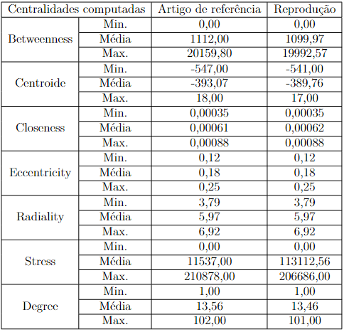
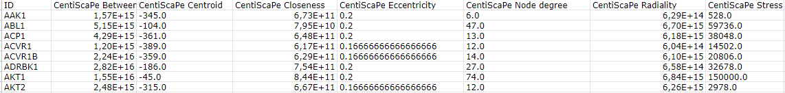
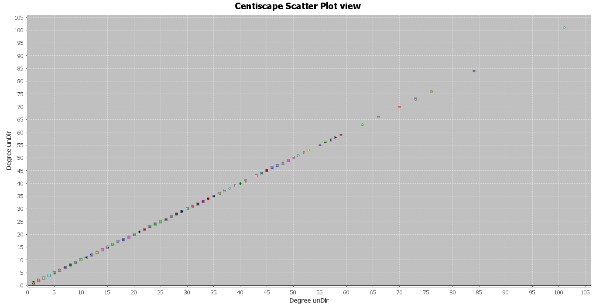
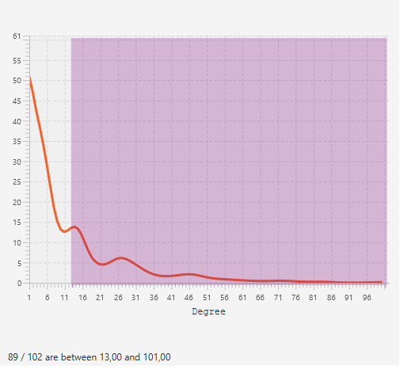
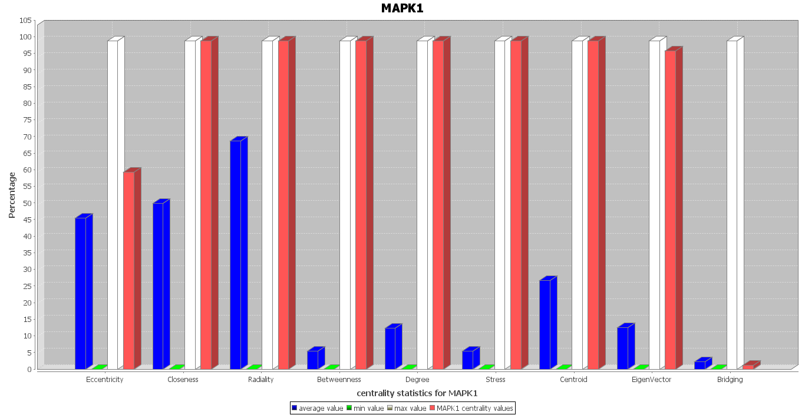
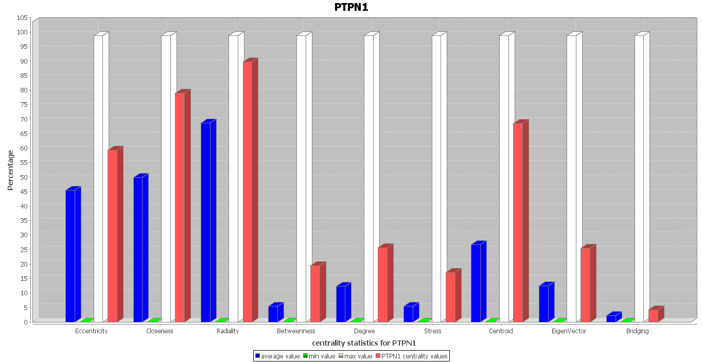
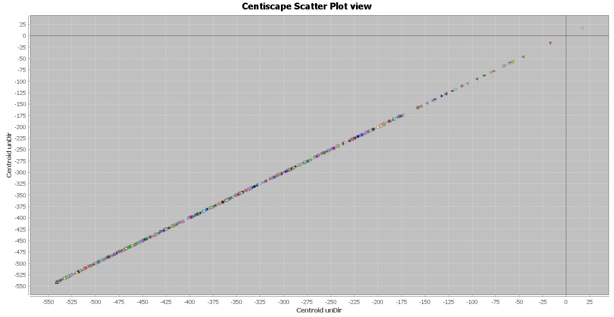
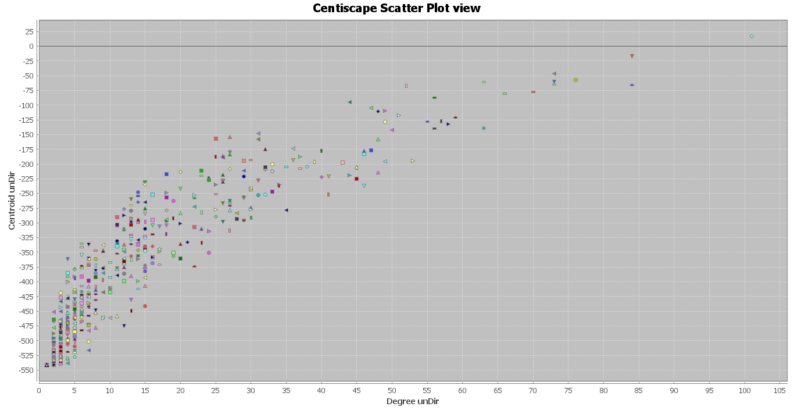
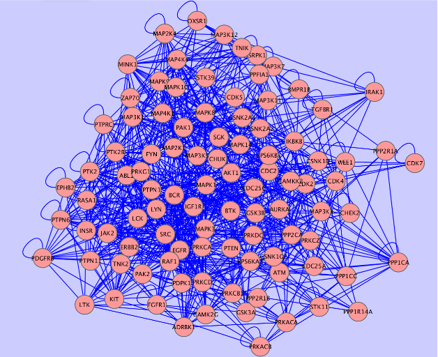
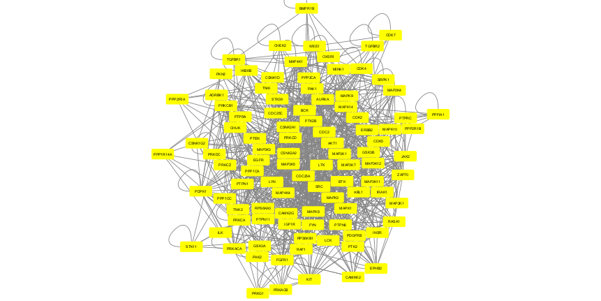

# Apresentação

O presente projeto foi originado no contexto das atividades da disciplina de pós-graduação [*Ciência e Visualização de Dados em Saúde*](https://ds4h.org), oferecida no primeiro semestre de 2022, na Unicamp.

> |Nome  | RA | Especialização|
> |--|--|--|
> | Rebeca Padovani Ederli  | 201482  | Ciência da Computação|

# Referência bibliográfica do artigo lido
> G. Scardoni, M. Petterlini, & C. Laudanna, "Analyzing biological network parameters with CentiScaPe." Bioinformatics 25(21), 2857–2859 (2009) https://doi.org/10.1093/bioinformatics/btp517.

# Resumo
> O artigo tem como objetivo mostrar como a ferramenta CentiScape é versátil e fácil de utilizar em bioinformática quando a análise de rede é baseada em centralidade, tanto para realização de cálculos e plot de resultados quanto para análise das saídas obtidas. Os autores demonstram a partir de experimentos realizados com dados de kino-phosphatome humano, que são um compilado de bancos de dados públicos (HPRD, BIND, DIP, IntAct, MINT e BioGRID). O artigo contém os resultados dos cáluclos de várias centralidades de rede, como Distância Média, Diâmetro, Grau, Tensão, Intermediação, Radialidade, Proximidade, Valor Centroide e Excentricidade, e análises biológicas provenientes dos resultados gerados.

# Breve descrição do experimento/análise do artigo que foi replicado
> Os dados fornecidos pelos autores são uma rede global de interatores de proteínas humanas, incluindo 11.120 nós e 84.776 interações não direcionadas únicas. Esses dados foram coletados das bases públicas HPRD, BIND, DIP, IntAct, MINT e BioGRID. Todas as reproduções realizadas foram feitas a partir da entrada de um subconjunto desta rede, que foi extraído e consiste apenas de interações conhecidas entre proteínas quinases e fosfatases humanas incluindo 543 nós e 3776 interações (os autores também realizam essa etapa, porém são obtidos 549 nós e 3844 interações da extração). 

> Por meio dessa entrada foram calculados os valores mínimo, máximo e médio de todas as centralidades computadas juntamente com o diâmetro e a distância média da rede para se ter uma visão geral das propriedades topológicas globais da rede kino-phosphatome. As centralidades computadas estão descritas a seguir:

> 1. Grau, ou *degree*, que permite uma avaliação imediata da relevância do nó. Proteínas com grau muito alto estão interagindo com várias outras proteínas.
> 2. Diâmetro, ou *diameter*, é a compacidade de uma rede biológica, pode ser interpretado como a facilidade de comunicação entre as proteínas;
> 3. Distância média, ou *distance average*, também representa a compacidade de uma rede biológica, embora os índices de centralidade devam ser calculados para apoiar essa indicação.
> 4. Excentricidade, ou *eccentricity*, pode ser interpretada como a facilidade de uma proteína ser alcançada por todas as outras proteínas da rede;
> 5. Proximidade, ou *closeness*, é probabilidade de uma proteína ser relevante para várias outras proteínas, mas com a possibilidade de ser irrelevante para algumas outras proteínas. Ou seja, uma proteína com alta proximidade, comparada à média de proximidade da rede, será facilmente central para outras proteínas;
> 6. Radialidade, ou *radiality*, também pode ser interpretada como a probabilidade de uma proteína ser relevante para várias outras proteínas, mas com a possibilidade de ser irrelevante para algumas outras proteínas;
> 7. Centralidade, ou *centrality*, sigifica a probabilidade de uma proteína ser capaz de organizar agrupamentos de proteínas. Uma proteína com alto valor de centroide, possivelmente estará envolvida na coordenação da atividade de outras proteínas altamente conectadas;
> 8. Estresse, ou *stress*, pode indicar a relevância de uma proteína como capaz de manter nós comunicantes juntos;
> 9. Intermediação, ou *Betweenness*, indica a capacidade de uma proteína de trazer em comunicação proteínas distantes.

> As outras reproduções realizadas estão listadas a seguir:

> 1. Cálculo de centralidades de cada nó;
> 2. 'plot by centrality', plotando grau sobre grau;
> 3. plot para análise de quantidade de nós com graus acima da média;
> 4. plot das centralidades da proteína quinase MAPK1;
> 5. plot das centralidades da proteína fosfatase PTPN1;
> 6. plot de centroide sobre centroide;
> 7. plot de grau sobre o centroide;
> 8. filtragem de nós com todos os valores de centralidade acima da média (geração de nova sub-rede).

## Dados usados como entrada
Dataset | Endereço na Web | Resumo descritivo
----- | ----- | -----
 GLOBAL-HGNC | https://academic.oup.com/bioinformatics/article/25/21/2857/227713#supplementary-data | Uma rede bipartida de proteínas quinases humanas conhecidas e as fosfatases com as quais elas interagem. É um compilado de conjuntos de dados públicos (HPRD, BIND, DIP, IntAct, MINT e BioGRID) de interatividade de proteínas humanas. O tipo de aresta é Vinculativo e os nós são Proteínas quinases e fosfatases (bipartido, não direcionado, não ponderado).

# Método e Resultados
> Para a reprodução dos resultados obtidos pelos autores, assim como apresentado no artigo, também foi utilizado o plug-in CentiScaPe (v. 2.2)juntamente com o CytoScape (v. 3.9.1). O plug-in calcula vários parâmetros de centralidade da rede e permite que o usuário analise as relações existentes entre os dados experimentais fornecidos e os valores de centralidade do nó calculados. Como o artigo apresenta claramente as etapas realizadas, a abordagem da reprodução dos experimentos foi realizada de forma a não alterar os parâmetros utilizados pelos autores e tentar encontrar, nas saídas, os mesmos resultados apresentados no artigo de referência. 

> Como mencionado, a partir da base de dados global fornecida pelos autores, foi extraída uma sub-rede consistindo apenas de interações conhecidas entre proteínas quinases humanas e fosfatases. A sub-rede resultante, chamada de *rede kino-phosphatome*, consiste em 543 nós e 3776 interações únicas (pelos autores foram encontrados 549 nós e 3844 interações únicas). Para realizar essa etapa foi utilizado um arquivo, obtido nos materiais suplementares dos autores, que contém as interações entre os nomes dessas proteínas. Para realizar a extração automática dessas interações presentes na rede global, e como os autores não mencionaram como foi realizada essa extração, nesta reprodução foi desenvolvido um código em linguagem Python (Jupyter Notebook) para realizar essa tarefa. 

> Em seguida, os autores apresentaram uma visão geral das propriedades topológicas globais da rede kino-phosphatome por meio dos valores mínimo, máximo e médio de todas as centralidades computadas juntamente com o diâmetro e a distância média da rede. Assim como os autores, essa etapa também foi realizada utilizando CentiScaPe. Os resultados obtidos dessa estapa apresentados no artigo de referência e da reprodução podem ser visualizados nas Tabela 1 e 2.

>
>Tabela 1 - Resultados dos parâmetros de centralidades globais da rede kino-phosphatome calculados usando CentiScaPe: valor médio, mínimo e máximo para cada centralidade computada. Comparação dos resultados apresentados no artigo de referência e na reprodução.

> |  | Distância média | Diâmetro|
> |--|--|--|
> | Artigo de referência  | 3,03  | 8,00|
> | Reprodução  | 3,03  | 8,00|

>Tabela 2 - Resultados dos parâmetros de centralidades globais da rede kino-phosphatome calculados usando CentiScaPe: Distância Média e Diâmetro. Comparação dos resultados apresentados no artigo de referência e na reprodução.

>Os autores destacaram que o cálculo das centralidades da rede permitiu uma primeira classificação das quinases e fosfatases humanas de acordo com seu papel central na rede.

> Os valores de centralidade nó a nó também foram gerados. Alguns dos resultados obtidos podem ser visualizados nas tabelas abaixo. Os demais resultados deste experimento podem ser encontrados nos materiais suplementares. Seguem alguns resultados obtidos pelos autores e na reprodução, respectivamente.

>
> Tabela 3 - Alguns valores de centralidade nó a nó da rede kino-phosphatome obtidos no artigo.

>
> Tabela 4 - Alguns valores de centralidade nó a nó rede kino-phosphatome obtidos na reprodução.

> A fim de indentificar os nós com maiores pontuações, os autores plotaram um gráfico grau x grau com o recurso 'plot by centrality' do CentiScaPe. O resultado gerado na reprodução desta etapa pode ser observado na figura abaixo. Os autores apontam que, como esperado, o gráfico resulta em uma distribuição linear e é notável que a distribuição não é uniforme já que muitos nós apresentam baixo grau e apenas alguns nós possuem alto grau.

>
> Figura 1 - Gráfico de dispersão grau sobre grau obtido na reprodução. Cada ponto representa um nome de proteína.

> O próximo experimento reproduzido consistem em utilizar o Network Analyzer para calcular a quantidade de nós com grau acima da média, ou seja *degree >= 13*. Um total de 89 nós apresentou um grau acima da média na reprodução e o histograma pode ser visualizado abaixo. Os autores chegaram no resultado de 186 nós com grau acima da média.

>
> Figura 2 - Histograma de grau x quantidade de nós, destacando nós que possuem grau acima da média gerado durante a reprodução.

> Ao analisar os resultados obtidos nas etapas anteriores, os autores destacam que a proteína quinase MAPK1 apresenta valores de centralidades elevados para a maioria das centralidades computadas sugerindo seu papel central regulador na estrutura e função da rede. O mesmo pode ser notado nos experimentos reproduzidos, e por isso, o próximo resultado gerado pelos autores e reproduzido consiste na representação 'plot by node' para MAPK1. 

>
> Figura 3 - 'plot by node' para MAPK1 obtido na reprodução. Para cada centralidade é mostrado o valor do nó específico (vermelho), o valor médio (azul), o valor mínimo (verde) e o valor máximo (branco).

> Entre as fosfatases, PTPN1 teve o grau mais alto, e pontuação alta também para outras centralidades. Assim, a análise de grau sugere que MAPK1 e PTPN1 são as quinases e fosfatases mais centrais, respectivamente. O resultado de 'plot by node' para PTPN1 reproduzido pode ser observado abaixo. 

>
> Figura 4 - 'plot by node' para PTPN1 obtido na reprodução. Para cada centralidade é mostrado o valor do nó específico (vermelho), o valor médio (azul), o valor mínimo (verde) e o valor máximo (branco).

> Em um outro experimento, os autores plotaram centroide x centroide que forneceu uma distribuição linear e quanto ao grau, a distribuição também não foi uniforme pois muitos nós apresentam centroide baixo enquanto apenas alguns nós têm centroide alto. Esse experimento foi realizado para apoiar mais as conclusões obtidas sobre as proteínas MAPK1 e PTPN1. O resultado do gráfico reproduzido deste experimento é apresentado a seguir. 

>
> Figura 5 - Gráfico de dispersão do centroide sobre centroide obtido na reprodução. Cada ponto representa um nome de proteína.

> Antes de apresentar os resultados do próximo experimento, é destacado pelos autores que o centroide médio foi -393 (aproximadamente -389 na reprodução). Com MAPK1 apresentando o maior valor de centroide 18 (17 na reprodução) e PTPN1 teve o maior valor de centroide, -154 (o mesmo na reprodução), entre todas as fosfatases. Quanto ao grau, também a análise do valor do centróide sugere uma distribuição livre de escala, sendo MAPK1 e PTPN1 as quinases e fosfatases mais centrais, respectivamente. Para evidenciar essa sugestão, os autores analisam o gráfico de grau x centroide, que foi reproduzido e pode ser analisado abaixo. É possível observar a distribuição não linear de nós, com poucos nós dispersos ocupando o quadrante superior direito do gráfico (alto grau e alto centroide). E os autores aindam chamam a atenção para esses nós, que podem representar quinases e fosfatases regulatórias particularmente importantes para a rede. O gráfico foi plotado utilizando o recurso 'plot by centralities' do CentiScape. Os valores das centralidades e o identificador do nó aparecem no CentiScaPe passando o mouse sobre cada forma geométrica do gráfico (isso é válido para todos os plots realizados).

>
> Figura 6 - 'plot por centralidades' do grau sobre o centroide obtido na reprodução. No canto superior direito do gráfico aparecem os nós com valores altos de grau e centroide. 

> O último experimento reproduzido foi extrair os nós mais relevantes desta sub-rede, os autores utilizaram o CentiScaPe para selecionar todos os nós com todos os valores de centralidade acima da média. Na reprodução foi utilizada a ferramenta de filtro padrão disponível no CytoScape. Após a filtragem, os autores obtiveram uma sub-rede kino-phosphatome composta por 97 nós e 962 interações. Na reprodução, o resultado foi de 99 nós e 3776 interações. Segundo os autores, esta sub-rede possivelmente representa um grupo de quinases e fosfatases altamente interativas que apresentam um papel crítico na regulação da fosforilação de proteínas em células humanas. As filtragens dos autores e da reprodução podem ser visualizadas e comparadas por meio das Figuras 7 e 8, respectivamente.

>
> Figura 7 - Sub-rede resultante da extração de todos os nós com todas as centralidades sobre a média obtida no artigo.

>
> Figura 8 - Sub-rede resultante da extração de todos os nós com todas as centralidades sobre a média obtida na reprodução.

> Os demais experimentos realizados envolveram outras bases de dados não disponibiizadas pelos autores e não encontradas publicamente.

> Ao comparar os resultados obtidos entre o artigo e a reprodução, nota-se que não houve muita diferença de valores. A filtragem da base de dados global realizada na reprodução não apresentou a mesma quantidade de nós (543) e interações (3776) que os autores (549 nós e 3844 interações) e isso afetou os cálculos realizados posteriormente. A segunda extração reproduzida apresentou maiores diferenças (99 nós e 3776 interações) em relação à extração realizada com o CentiScape pelos autores (97 nós e 962 interações).

> E por fim, pode-se concluir o mesmo que os autores. O CentiScaPe é uma ferramenta de bioinformática versátil e fácil de utilizar de forma integrada ao CytoScape. Os resultados apresentados com o painel de resultados, as opções 'plot by node' e 'plot by centrality' facilitam a visualização e a análise de redes complexas derivadas de dados experimentais, mais especificamente de dados biológicos.