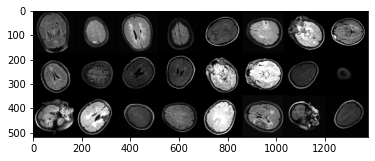
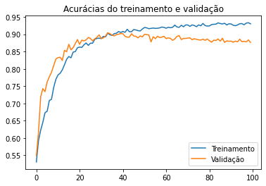
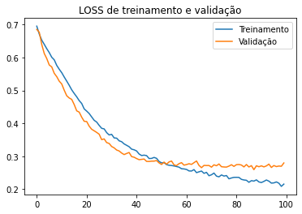
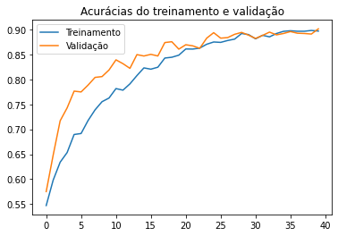
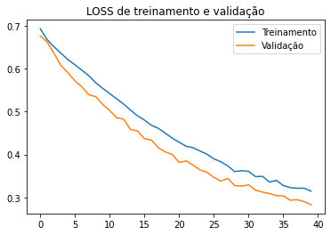
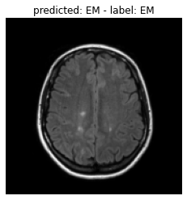
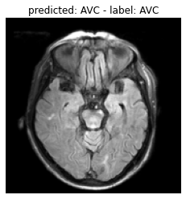
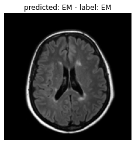
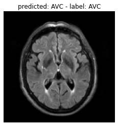

# Projeto 4 – Classificação de lesões de substância branca no Lúpus
# Project 4 - Classification of white matter lesions in Lupus.

# Apresentação

O presente projeto foi originado no contexto das atividades da disciplina de pós-graduação [*Ciência e Visualização de Dados em Saúde*](https://ds4h.org), oferecida no primeiro semestre de 2022, na Unicamp.

> |Nome  | RA | Especialização|
> |--|--|--|
> | Rebeca Padovani Ederli | 201482  | Ciência da Computação|

# Introdução
> O objetivo principal do projeto é diferenciar lesões isquêmicas e desmielinizantes por meio de um classificador e, assim, identificar qual a etiologia mais provável das lesões presentes em pacientes de Lúpus Eritematoso Sistêmico (SLE).
> A etiologia da lesão é importante para o tratamento adequado e um método que distingue lesões desmielinizantes de isquêmicas e pode ser usado para caracterizar lesões de etiologia desconhecida. As estiologias são isquêmica e desmielinizante e as lesões da substância branca apresentam-se brilhante em T2w e FLAIR (hiperintensidades de substância branca).

## Ferramentas
> * Linguagem de programação Python;
> * Jupyter Notebook;
> * Google Colaboratory.

## Preparo e uso dos dados
> Os dados utilizados correspondem aos dados separados para a tarefa de Deep Learning ("Data_P4_DL"). Não foram utilizadas as máscaras para nenhum tipo de processo neste trabalho.

> * Todas as imagens foram redimensionadas para 170x170.
> * *Data augmentation*: foi aplicada a técnica de *data augmentation* nas imagens dos conjuntos de treinamento e validação. As transformações realizadas com *data augmentation* incluem:
> 1. Flip horizontal: as inversões de imagem são realizadas ao longo de um eixo de simetria. Para aprimoramento de imagens médicas, elas podem ser realizadas tanto na vertical quanto na horizontal;
> 2. Flip Vertical;
> 3. Rotação em 45 graus;
> 4. Rotação em 90 graus;
> 5. Brilho variando entre 0.5 e 1.2: quanto menor o valor, mais escura é a imagem;
> 6. Contraste variando entre 0.8 e 1.2: quando o contraste é aumentado, o número de pixels brancos e pretos na imagem também aumenta;
> 7. Afiação (ou *sharpening*), com fator 2: transformação que aumenta o contraste nas bordas da imagem, dando uma aparência mais nítida.

> As transformações para gerar novos dados foram realizadas de forma aleatória.
> Algumas imagens geradas com *data augmentation* no conjunto de treinamento podem ser observadas na Figura 1.

> 
 
> Figura 1 - Algumas imagens geradas com *data augmentation* por meio do conjunto de treinamento.

# Metodologia
> Foi utilizado um classificador baseado em Deep Learning, a arquitetura ResNet-18. A ResNet-18 possui 18 camadas de profundidade. É possível carregar uma versão pré-treinada da rede treinada em mais de um milhão de imagens do banco de dados ImageNet [1]. A rede pré-treinada pode classificar imagens em 1000 categorias de objetos e muitos animais. Como resultado, a rede aprendeu representações ricas de recursos para uma ampla variedade de imagens. Por esse motivo, essa arquitetura foi escolhida neste trabalho. Foi utilizada a versão não pré-treinada desta rede. Uma camada NN linear foi adicionada à arquitetura com 2 neurônios de saída.

> Os dados foram dividos em aproximadamente 90% para o conjunto de treinamento e 10% para o conjunto de teste. O conjunto de validação correspode a aproximadamente 26% do conjunto de treinamento. Resultando em 507 imagens para treinamento, 182 para validação e 78 para teste.

> Como proposto em atividade, foi realizada a aumentação de dados a fim de melhorar a acurácia apresentada pelo modelo. A técnica de *data augmentation* utilizou transformações, já citadas anteriormente, que não comprometessem as informações das imagens médicas [2]. 

> Os parâmetros do modelo foram adotados com base na atividade realizada em aula: *taxa de aprendizado = 0.00005* e otimizador SGD. *Cross Entropy Loss* foi utilizada para calcular a perda de entropia cruzada entre a entrada e o alvo.

> O primeiro treinamento consistiu em realizar 100 épocas para visualização do efeito overfitting. Os resultados das médias (10 iterações) das acurácias obtidas ao longo das 100 épocas durante o treinamento, sob os conjuntos de treinamento e validação podem ser visualizados na Figura 2. Por meio do gráfio **acurácias do treinamento e validação x época**, é possível observar que com os dados de treinamento, o classificador atinge 95% de acurácia média mas, com o os dados de validação, a métrica não passa de 90%. Nesse sentido, é notável que o overfitting ocorre a partir da 40ª época.

> 

> Figura 2 - Gráfico das médias das acurácias x épocas ao longo de 100 épocas.

> O gráfico **loss de treinamento e validação x época** (Figura 3) exibe os resultados da função de perda em 100 épocas, sendo a média de 10 iterações. Nota-se que a partir da 40ª época, *loss* para de diminuir sob o conjunto de validação.

> 

> Figura 3 - Gráfico das médias de *loss* x épocas ao longo de 100 épocas.

> A fim de mitigar o efeito do overfitting, foi realizado outro treinamento apenas com 40 épocas. As acurácias obtidas com o conjunto de treinamento e validação ao longo de 40 epócas podem ser observadas na Figura 4. E os resultados de *loss* podem ser visualizados no gráfico da Figura 5.

> 

> Figura 4 - Gráfico das médias das acurácias x épocas ao longo de 40 épocas.

> 

> Figura 5 - Gráfico das médias de *loss* x épocas ao longo de 40 épocas.

> Ao treinar o classificador por 40 épocas, o efeito de overfitting é mitigado com o classificador atingindo 90% de acurácia média utilizando os dois conjuntos de dados, e a função *loss* continua em queda.

> As métricas calculadas a partir dos resultados foram especificidade, sensibilidade, acurácia e matriz de confusão. Os testes foram realizados no conjunto de teste estabelecido e no conjunto de teste apresentado na atividade em aula para verificar como o modelo está atuando. Em seguida, foram realizadas as predições no conjunto SLE.

> A Tabela 1 apresenta os resultados obtidos na predição do classificador para o conjunto de teste estabelecido (contém 78 imagens de diferentes indíviduos). A acurácia, especificidade e sensibilidade para este conjunto foram de 100%.

> | Predição/Real | AVC | EM |
> |--|--|--|
> | AVC |  33 | 0 |
> | EM |  0  |  45 |

> Tabela 1 - Conjunto de teste - matriz de confusão. 

> Algumas figuras com os resultado da predição podem ser visualizadas abaixo.

>  

>  

> O classificador treinado também foi testado nos dados de teste apresentado em aula para atividade. Este conjunto possui 225 imagens. O resultado obtido pode ser visualizado na matriz de confusão da Tabela 2.

> | Predição/Real | AVC | EM |
> |--|--|--|
> | AVC |  79 | 0 |
> | EM |  0  |  146 |

> Tabela 2 - Conjunto de teste da atividade - matriz de confusão. 

> Assim como o conjunto de teste apresentado anteriormente, a acurácia, especificidade e sensibilidade para este conjunto chegaram a 100%. Neste sentido, é possível notar que o modelo consegue classificar as imagens de conjuntos não vistos antes e é razoável considerar que há generalização em seu aprendizado.

# Resultados Obtidos e Discussão
> Esta seção deve apresentar o resultado de predição das lesões de LES usando o classificador treinado. Também deve tentar explicar quais os atributos relevantes usados na classificação obtida
> * apresente os resultados de forma quantitativa e qualitativa
> * tenha em mente que quem irá ler o relatório é uma equipe multidisciplinar. Descreva questões técnicas, mas também a intuição por trás delas.

# Conclusão
> Após as discussões e análises realizadas é possível concluir que o modelo treinado conseguiu resultados satisfatórios em classificar os dados que não tiveram contato com o classificador durante o treinamento. O modelo atingiu 100% de acurácia para os testes realizados e por isso, pode-se considerar que há generalização. A aumentação de dados possibilitou que o classificador aprendesse diversas formas de entender a entrada de imagens apresentadas para o problema de classificar lesões isquêmicas e desmielinizantes e também foi o principal fator para atingir a generalização obtida pelo modelo, tendo em vista que na atividade realizada em aula, o resultado da classificação foi comprometida por, entre outros possíveis motivos, não utilizar a aumentação de dados. 

> O principal desafio encontrado foi a compreensão de quais atributos foram relevantes para a classificação das imagens, tendo em vista que o aprendizado profundo estabece esses atributos de forma a aplicar diversos filtros.

> * o que poderia ser melhorado se houvesse mais tempo?

# Referências Bibliográficas
> [1] ImageNet . http://www.image-net.org

> [2] HUSSAIN, Zeshan et al. Differential data augmentation techniques for medical imaging classification tasks. In: AMIA annual symposium proceedings. American Medical Informatics Association, 2017. p. 979. <https://www.ncbi.nlm.nih.gov/pmc/articles/PMC5977656/>
